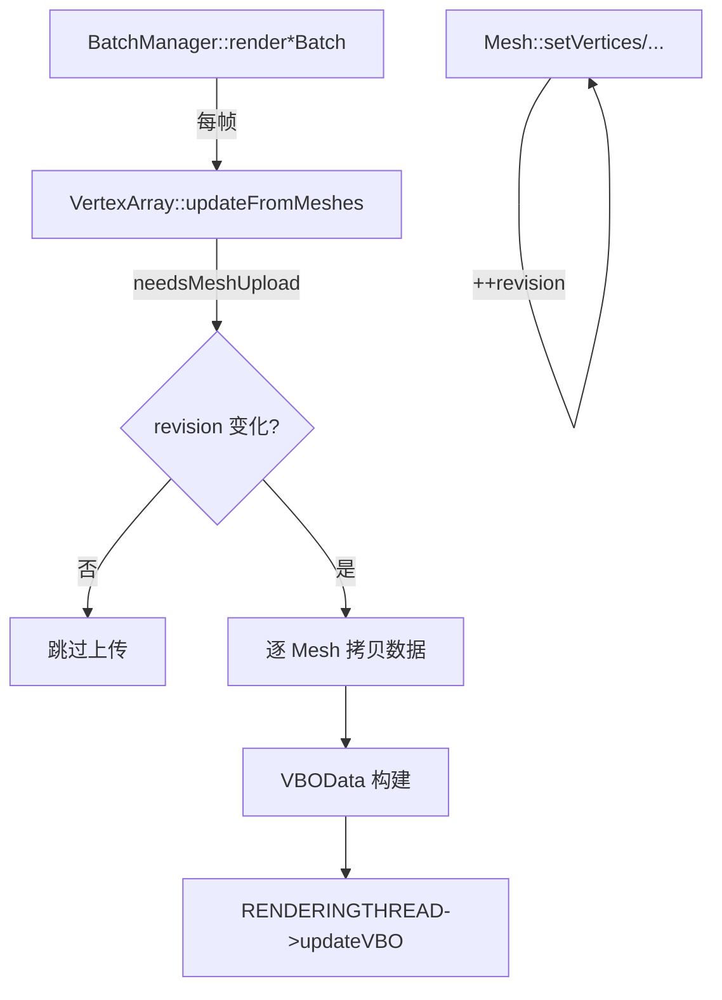

# VertexArray::updateFromMeshes 优化分析

## 1. 概述

本文档对 `VertexArray::updateFromMeshes` 的当前实现进行性能分析，评估优化必要性，并给出分级优化方案。

**分析范围**：`src/renderer/resource/VertexArray.cpp` 中 `updateFromMeshes` 方法的 CPU 端数据拷贝与布局构建逻辑。

---

## 2. 当前实现分析

### 2.1 调用链路



**关键特征**：`updateFromMeshes` 仅在 `needsMeshUpload()` 返回 `true` 时才执行数据拷贝，静态 UI 大部分帧都会命中跳过路径。

### 2.2 典型数据规模

MorrowUI 的 Mesh 以 UI 元素为主，顶点数极小：

| 元素类型 | 顶点数 | 索引数 | 属性 |
|---|---|---|---|
| Quad（按钮/图片） | 4 | 6 | Position + UV + BatchID |
| 文本（单字符） | 4 | 6 | Position + UV + BatchID |
| 文本（10 字） | 40 | 60 | Position + UV + BatchID |
| 立方体 | 24 | 36 | Position + Normal + UV |
| 复杂 3D UI | 数百～数千 | 数百～数千 | Position + Normal + UV + Color |

大多数 UI 场景中，单次 `updateFromMeshes` 处理的顶点总数 < 100，mesh 数量 1~5。

### 2.3 当前属性布局

```
vertexData (uint8_t 数组):
┌────────────────────────────────────────────────────────────┐
│ Position[N]  │ BatchID[N]  │ Color[N]?  │ UV[N]?  │ Normal[N]? │
│ Vector3 × N  │  float × N  │ Vector4 × N │Vector2×N │ Vector3 × N │
└────────────────────────────────────────────────────────────┘
```

属性按块排列（非交错），N = totalVertexCount。

---

## 3. 性能问题识别

### 3.1 问题一：BatchID 逐顶点 memcpy（严重程度：中）

```cpp
// 当前代码 (VertexArray.cpp 行 170-175)
auto batchIdFloat = static_cast<float>(batchId);
for (size_t i = 0; i < meshVertexCount; ++i) {
    memcpy(vboData->vertexData.data() + currentBatchOffset + i * sizeof(float),
           &batchIdFloat,
           sizeof(float));
}
```

**分析**：用 `memcpy` 在循环中逐 float 写入相同的 batchId。`memcpy` 每次调用有函数开销，且编译器无法将其优化为批量填充。

**影响**：对 N=4 的 quad，调用 4 次 `memcpy`；对 N=1000，调用 1000 次。在小 N 场景下开销可忽略，但模式较差。

### 3.2 问题二：默认值逐顶点填充（严重程度：中）

```cpp
// 当前代码 - 颜色默认值 (行 182-189)
Vector4 defaultColor(1.0f, 1.0f, 1.0f, 1.0f);
for (size_t i = 0; i < meshVertexCount; ++i) {
    memcpy(vboData->vertexData.data() + currentColorOffset + i * sizeof(Vector4),
           &defaultColor,
           sizeof(Vector4));
}
```

同样的 `memcpy` 循环模式，UV 和 Normal 的默认值填充也有相同问题。

**影响**：仅当同一批次中不同 mesh 属性不均匀时触发（如 mesh A 有 Color，mesh B 没有），实际触发频率较低。

### 3.3 问题三：偏移量重复计算（严重程度：低）

```cpp
// 每个 mesh 循环内重新计算
size_t currentPosOffset = vertexOffset * sizeof(Vector3);
size_t currentBatchOffset = posSize + vertexOffset * sizeof(float);
size_t currentColorOffset = posSize + batchIdSize + vertexOffset * sizeof(Vector4);
size_t currentUVOffset = posSize + batchIdSize + colorSize + vertexOffset * sizeof(Vector2);
size_t currentNormalOffset = posSize + batchIdSize + colorSize + uvSize + vertexOffset * sizeof(Vector3);
```

`posSize`、`batchIdSize`、`colorSize`、`uvSize` 在循环外已确定，可将 stride 预计算为常量。

### 3.4 问题四：两次遍历 meshFilters（严重程度：低）

第一次遍历统计 `totalVertexCount`/`hasColors`/...，第二次做数据拷贝。对于 N 很小的 UI mesh，两次遍历的成本可以忽略，但增加了代码复杂度。

### 3.5 问题五：索引类型转换逐元素（严重程度：低）

```cpp
const std::vector<int16_t>& meshIndices = mesh->getIndices();
for (size_t i = 0; i < meshIndexCount; ++i) {
    vboData->indices[indexOffset + i] =
        static_cast<uint32_t>(meshIndices[i]) + static_cast<uint32_t>(vertexOffset);
}
```

对每个索引单独转换。对于 6 个索引的 quad，开销为零。

### 3.6 问题六：drawMode 覆盖语义（严重程度：低—正确性风险）

```cpp
drawMode = mesh->getDrawMode(); // 使用最后一个有效的mesh的绘制模式
```

如果一个批次中包含不同 drawMode 的 mesh，只有最后一个生效。当前合批策略保证同批次 drawMode 一致，但代码本身缺乏防御性检查。

---

## 4. 优化必要性与收益评估

### 4.1 是否需要优化？

**结论：低优先级优化，但建议实施 P0 级修改（代码质量层面）。**

理由：

| 考量维度 | 评估 |
|---|---|
| **UI 顶点规模** | 极低（4~100），现有 O(N) 算法完全可接受 |
| **调用频率** | 仅 dirty mesh 触发，静态 UI 大部分帧跳过 |
| **实测瓶颈** | 未见 profiler 数据显示此处为热点 |
| **代码质量** | 存在明显的反模式（循环 memcpy 单值） |
| **鲁棒性** | 若未来接入大顶点数的 3D mesh，当前实现会明显退化 |
| **项目原则** | 符合"优化前应先建立基线"（ARCHITECTURE.md §16） |

### 4.2 预期收益

| 优化项 | CPU 收益（典型 UI 场景） | CPU 收益（1000 顶点） |
|---|---|---|
| BatchID std::fill | 不可测 | ~50× |
| 默认值 std::fill | 不可测 | ~50× |
| 单次遍历 | 不可测 | ~5% |
| SIMD 索引转换 | 0 | ~4× |

对当前 UI 场景，性能收益**不可测量**。优化价值主要在于：
1. 消除代码坏味道；
2. 防止未来大 mesh 场景下的性能退化；
3. 提升代码可读性和可维护性。

---

## 5. 分级优化方案

### P0：代码质量修正（建议立即实施）

修改范围有限、无副作用、提升代码质量。

#### 5.1.1 BatchID 填充改为 std::fill

```cpp
// 替换前：
auto batchIdFloat = static_cast<float>(batchId);
for (size_t i = 0; i < meshVertexCount; ++i) {
    memcpy(vboData->vertexData.data() + currentBatchOffset + i * sizeof(float),
           &batchIdFloat, sizeof(float));
}

// 替换后：
auto* batchPtr = reinterpret_cast<float*>(
    vboData->vertexData.data() + currentBatchOffset);
std::fill_n(batchPtr, meshVertexCount, static_cast<float>(batchId));
```

#### 5.1.2 默认值填充改为 std::fill_n

```cpp
// 替换前（颜色默认值）：
Vector4 defaultColor(1.0f, 1.0f, 1.0f, 1.0f);
for (size_t i = 0; i < meshVertexCount; ++i) {
    memcpy(vboData->vertexData.data() + currentColorOffset + i * sizeof(Vector4),
           &defaultColor, sizeof(Vector4));
}

// 替换后：
auto* colorPtr = reinterpret_cast<Vector4*>(
    vboData->vertexData.data() + currentColorOffset);
std::fill_n(colorPtr, meshVertexCount, Vector4(1.0f, 1.0f, 1.0f, 1.0f));
```

UV 默认值 `Vector2(0,0)`、Normal 默认值 `Vector3(0,1,0)` 同理。

#### 5.1.3 drawMode 一致性断言

```cpp
// 在循环内增加防御性检查
if constexpr (MORROW_DEBUG) {
    if (mesh->getDrawMode() != drawMode && totalVertexCount > mesh->getVertexCount()) {
        // 警告：同一批次中出现不一致的 PrimitiveType
    }
}
drawMode = mesh->getDrawMode();
```

### P1：微小结构优化（低风险，建议实施）

#### 5.2.1 预计算 per-attribute stride

```cpp
// 在进入拷贝循环前：
const size_t posStride = sizeof(Vector3);
const size_t batchStride = sizeof(float);
const size_t colorStride = hasColors ? sizeof(Vector4) : 0;
const size_t uvStride = hasUVs ? sizeof(Vector2) : 0;
const size_t normalStride = hasNormals ? sizeof(Vector3) : 0;

// 循环内简化为：
size_t currentPosOffset = vertexOffset * posStride;
size_t currentBatchOffset = posSize + vertexOffset * batchStride;
size_t currentColorOffset = posSize + batchIdSize + vertexOffset * colorStride;
// ...
```

#### 5.2.2 合并两次遍历为一次（可选）

当前两次遍历 meshFilters 在 UI 小 N 场景下无实际收益，但可以简化代码结构：

```cpp
// 取消第一次遍历，直接在拷贝循环中动态扩容
// 代价：vertexData 需支持动态增长（目前是预分配，更适合当前模式）
```

**建议**：保持两次遍历。预分配一次 `resize` 比多次 `push_back`/扩容更高效。

### P2：架构级优化（需要 Profiler 数据支撑后再决策）

#### 5.3.1 交错顶点布局

当前块状布局 `[Pos×N][BatchID×N][Color×N]...` 对 GPU 缓存不友好。标准做法是交错布局 `[Pos,BatchID,Color,UV,Normal]×N`。

**收益**：GPU 顶点着色阶段的缓存命中率提升。
**代价**：拷贝逻辑需要重写；每个 mesh 数据需要逐顶点交错写入。
**决策依据**：需要用 GPU profiler 确认顶点着色是否为瓶颈。

#### 5.3.2 Mesh 数据直接写入 VBOData（零拷贝）

当前流程：
```
Mesh::m_vertices (Vector3[]) → memcpy → VBOData::vertexData (uint8_t[])
```

理想流程：
```
Mesh 直接持有 VBOData 兼容格式 → 零拷贝引用传递
```

**代价**：Mesh 类与 VBOData 格式耦合；需要引入格式抽象层。
**决策依据**：当前项目原则 §3.3 鼓励"避免每帧复制"，但 ARCHITECTURE.md §15.1 已将此列为后续优化方向。可在 RenderItem 紧凑化时一并进行。

#### 5.3.3 索引转换 SIMD

对于大索引数组，可用 SSE/NEON 并行转换 int16→uint32 并加偏移。

**当前不需要**：UI 索引数极少。

### P3：鲁棒性增强

#### 5.4.1 VBOData 容量预留

```cpp
// 在循环前根据 totalVertexCount 和 totalIndexCount 预估精确容量
vboData->vertexData.reserve(totalSize);
vboData->indices.reserve(totalIndexCount);
```

当前 `resize` 后直接写入已是最优，但可增加 `shrink_to_fit` 在帧末回收时减少内存占用。

#### 5.4.2 RecyclePool VBOData 清理

从回收池取出 VBOData 后，当前代码手动 clear：
```cpp
vboData->attributes.clear();
vboData->vertexData.clear();
vboData->indices.clear();
```

建议封装为 `VBOData::reset()` 方法，确保所有字段一致复位。

---

## 6. 推荐实施路径

```
Phase 1（本周，~1h）
├── P0: BatchID std::fill_n
├── P0: 默认值 std::fill_n
├── P0: drawMode 调试断言
└── P0: VBOData::reset() 封装

Phase 2（下个迭代，~2h，条件触发）
├── P1: 预计算 per-attribute stride
└── P3: RecyclePool 清理逻辑优化

Phase 3（需 Profiler 支撑）
├── P2: 交错布局    ← 需确认 GPU 瓶颈
├── P2: 零拷贝      ← 需配合 RenderItem 紧凑化
└── P2: SIMD 索引   ← 仅大 3D 场景有价值
```

---

## 7. 决策矩阵

| 方案 | 代码改动量 | 风险 | UI 收益 | 大 Mesh 收益 | 建议 |
|---|---|---|---|---|---|
| P0 std::fill_n | 5 行 | 零 | 无 | 显著 | ✅ 立即实施 |
| P1 stride 预计算 | 10 行 | 极低 | 无 | 微小 | ✅ 下个迭代 |
| P2 交错布局 | ~100 行 | 中 | 微小 | 中 | ⏸ 需 profiler |
| P2 零拷贝 | ~200 行 | 高 | 微小 | 显著 | ⏸ 架构评审 |
| P2 SIMD 索引 | 30 行 | 低 | 无 | 中 | ⏸ 出现瓶颈时 |

---

## 8. 总结

**核心结论**：`VertexArray::updateFromMeshes` 当前实现对于 MorrowUI 的 UI 渲染场景**性能充足**，不必急于进行大幅优化。

**建议行动**：
1. 立即修复 P0 级代码反模式（`memcpy` 循环 → `std::fill_n`），提升代码质量；
2. 后续随 RenderItem 紧凑化（ARCHITECTURE.md §15.1）和合批 Key 优化（§15.3）统一考虑数据布局改进；
3. 在当前阶段，将精力集中在 SSBO 路径、Dirty 标记完善和合批 Key 缓存等更高优先级的优化项上。
